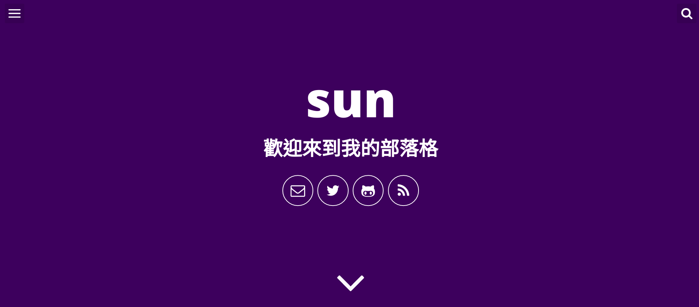
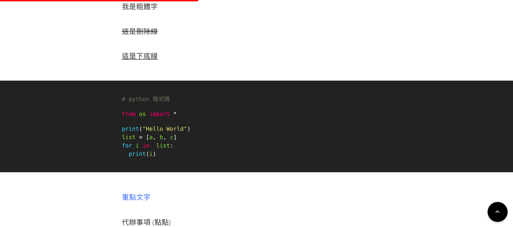

# 關於 new-will

:arrow_right: 這個專案的作者並不是我 :arrow_left:

這個專案是源自於 [willianjusten](https://github.com/willianjusten) 的 [will-jekyll-template](https://github.com/willianjusten/will-jekyll-template), 由於此專案已經停止維護, 所以我將其 fork 過來, 並加入了一些 javascript 工具, 以下的說明僅適用於 Linux, Windows 暫時沒有說明, 如果喜歡這個 Jekyll 部落格主題, 歡迎前往[原專案](https://github.com/willianjusten/will-jekyll-template)給顆 star



## 事前準備

1. 安裝 Ruby

```console
$ sudo apt install ruby
```

2. 安裝 Jekyll

```console
$ sudo gem install jekyll
```

3. 安裝 NPM

```console
$ sudo apt install npm
```

4. 安裝 Gulp (注意版本不得超過 3.9.1, 不然會出錯)

```console
$ sudo npm install -g gulp@3.9.1
```

## 部落格設定

1. 依照下方的註解填寫 _config.yml

```xml
# Site settings
title: # 部落格名稱
description: # 部落格簡介
baseurl: "" # 部落格位置 (可留白)
url: "" # 部落格網址

# User settings
username: # 作者名稱
user_description: # 作者自述
user_title: # 首頁自述
email: # 電子郵件
twitter_username: # twitter 使用者名稱
github_username: # github 使用者名稱
```

### 範例

```xml
# Site settings
title: 我的部落格
description: 紀錄生活的部落格
baseurl: ""
url: "https://t6y4sun.github.io"

# User settings
username: sun
user_description: 住在火星, 目前在 NASA 工作
user_title: 歡迎來到我的部落格
email: t6u4sun@gmail.com
twitter_username: t6u4sun
github_username: t6u4sun
```

### 設定作者的照片

將您的照片檔名改成 blog-author.jpg 並移動至 assets/img 取代原本的 blog-author.jpg

__照片尺寸建議不要超過 500X500__

### 部落格 icon

如需更改部落格的 icon, 請替換 assets/icons 裡面的 *favico.ico* 及 *favico-16x16.ico*

### 部落格主題顏色

設定檔於 src/styl/*_variables.styl*

下列為設定檔內容

```css
// COLORS
main = #33135C
hover = darken(main, 50%)
sec  = #FFFFFF
lightGray = #F2F2F2
texts = #333333
colorcode = #3085F4
// Resolution
cut = 37.5rem
```

### 更改的檔案

1. src/js/simpleJekyllSearch.js

第 4 行
```js
jsonFile        : 'https://你的github使用者名稱.github.io/search.json',
```

解說: 讓搜尋功能運作

2. _includes/footer.html

第 2 行
```html
<p>此部落格為 <a href="https://github.com/你的github使用者名稱" target="_blank">你的github使用者名稱</a> 擁有</p>
```

解說: 更改部落格的 footer

## 建立文章

以下指令可以建立一篇新的文章

```console
$ bash initpost.sh -c 文章標題
```

initpost.sh 會在您的 _posts/ 建立一篇 markdown 文件, 其格式為 年-月-日-文章名稱.md, 內容及註解如下

```markdown
---
layout: post # 類別
title: "test" # 文章標題
date: 2021-03-24 21:09:04 # 建立日期
image: '/img/' # 文章圖庫位置
description: # 文章概要
tags: # 標籤
categories: # 文章主題
twitter_text: # Twitter 上顯示的文章概要
---
```

可以將文章所需要的圖片放置到 /img/ 即可在文章中使用

---

 圖片位置 /img/desktop.png

```markdown
 
```

## 注意事項

about.html 需要自己編輯, 可能會需要基本的 HTML 知識, 請斟酌編輯

## 恭喜! Build 你的部落格!

恭喜您! 在 push 之前, 別忘了使用 gulp 來建置您的部落格!

1. cd 到您的部落格位置

```console
$ cd yourblog/
```

2. 安裝 node 插件 (只有第一次需要執行)

```console
$ npm install
```

__可能會有許多 warning, 無須理會__

3. 執行 gulp

```console
$ gulp
```

現在您應該會看到瀏覽器自動開啟並顯示您的部落格!


